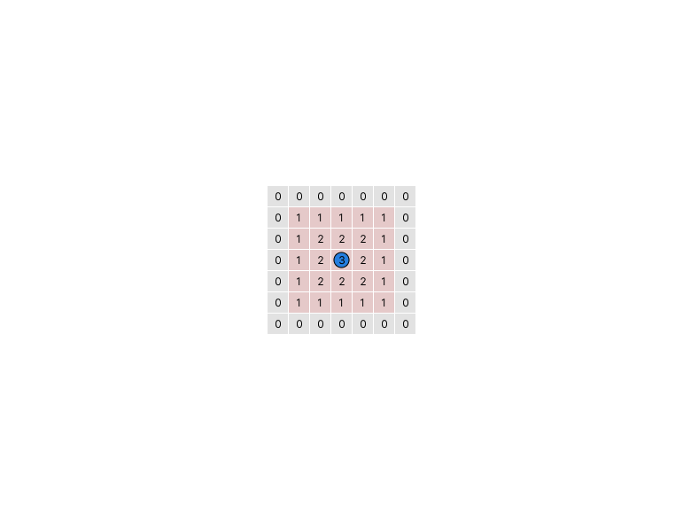
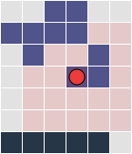
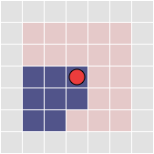
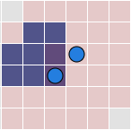

# Lux AI Season 3 Specs

For documentation on the API, see [this document](https://github.com/Lux-AI-Challenge/Lux-Design-S3/blob/main/kits/). To get started developing a bot, see [our Github](https://github.com/Lux-AI-Challenge/Lux-Design-S3/).

We are always looking for feedback and bug reports, if you find any issues with the code, specifications etc. please ping us on [Discord](https://discord.gg/aWJt3UAcgn) or post a [GitHub Issue](https://github.com/Lux-AI-Challenge/Lux-Design-S3/issues)

## Background
With the help [600+ space organizations](https://www.kaggle.com/competitions/lux-ai-season-2/leaderboard), Mars has been terraformed successfully. Colonies have been established successfully by multiple space organizations thanks to the rapidly growing lichen fields on the planet. The introduction of an atmosphere has enabled colonists to start thinking about the future, beyond Mars. Mysteriously, new deep-space telescopes launched from Mars revealed some ancient architectures floating beyond the solar system, hidden in a midst of asteroids and nebula gas. Perhaps they were relics of a previous sentient species?

Seeking to learn more about the secrets of the universe, new expeditions of ships were set out into deep space to explore these ancient relics and study them. What will they discover, which expedition will be remembered for the rest of history for unlocking the secrets of the relics?

## Environment

In the Lux AI Challenge Season 3, two teams compete against each other on a 2D map in a best of 5 match sequence (called a game) with each match lasting 100 time steps. Both teams have a pool of units they can control to gain points around the map while also trying to prevent the other team from doing the same.

Unique to Season 3 is how various game mechanics and parameters are randomized at the start of each game and remain the same between matches in one game. Some mechanics/paramters include the map terrain/generation, how much units can see on the map, how might they be blocked by map features, etc. Each match is played with fog of war, where each team can only see what their own units can see, with everything else being hidden. Given that some mechanics are randomized between games, the specs will clearly document how they are randomized and what the possible values are. There is also a summary table of every game parameter that is randomized between games in the [Game Parameters](#game-parameters) section.

A core objective of this game is a balanced strategy of exploration and exploitation. It is recommended to explore more in the first match or two before leveraging gained knowledge about the map and opponent behavior to win the latter matches.

## Map

The map is a randomly generated 2D grid of size 24x24. There are several core features that make up the map: Empty Tiles, Asteroid Tiles, Nebula Tiles, Energy Nodes, and Relic Nodes. Notably, in a game, the map is never regenerated completely between matches. Whatever is the state of the map at the end of one match is what is used for the next match.

### Empty Tiles

These are empty tiles in space without anything special about them. Units and nodes can be placed/move onto these tiles.

### Asteroid Tiles
Asteroid tiles are impassable tiles that block anything from moving/spawning onto them. These tiles might move around over time during the map in a symmetric fashion. Sometimes asteroid tiles might move on top of existing units. In the game the unit is not removed as a result of this and can still take actions and move around provided there is an non asteroid tile adjacent to it.

### Nebula Tiles
Nebula tiles are passable tiles with a number of features. These tiles might move around over time during the map in a symmetric fashion.

*Vision Reduction*: Nebula tiles can reduce/block vision of units. Because of vision reduction it is even possible for a unit to be unable to see itself while still being able to move! See [Vision](#vision) for more details on how team vision is determined. All nebula tiles have the same vision reduction value called `params.nebula_tile_vision_reduction` which is randomized from 0 to 3. 

*Energy Reduction*: Nebula tiles can reduce the energy of units that end their turn on them. All nebula tiles have the same energy reduction value called `params.nebula_tile_energy_reduction`.

### Energy Nodes

Energy nodes are mysterious objects that emit energy fields which can be harvested by units. These nodes might move around over time during the map in a symmetric fashion. In code, what actually occurs in each game is energy nodes are randomly generated on the map symmetrically and a random function is generated for each node. Each energy node's function is a function of distance. The energy value of a tile on a map is determined to be the sum of the energy node functions applied to the distance between tile and each node.
<!-- TODO link to code -->

### Relic Nodes

Relic nodes are objects in space that enable ships to go near it to gain team points. These relic nodes however are ancient and thus fragmented. As a result, only certain tiles near the relic nodes when a friendly ship is on it will gain points. The tiles that yield points are always hidden and can only be discovered by trial and error by moving around the relic nodes. Relic node positions themselves can be observed if withins sensor range. The tiles around relic nodes can overlap with tiles of other relic nodes but will not yield extra points if that occurs and is treated as one tile.

In code, a random 5x5 configuration / mask centered on the relic node is generated indicating which tiles yield points and which don't. Multiple ships can stack on one tile but will only yield at most one point per tile. Note that ship stacking can be risky due to the [sapping action](#sap-actions).

## Units

Units in the game are ships that can move one tile in 5 directions (center, up, right, down, left) and perform a ranged energy sapping action. Units can overlap with other friendly units if they move onto the same tile. Units have a energy property which determines whether they can perform actions and start with 100 energy and can have a max of 400 energy. Energy is recharged via the energy field of the map. They always spawn on one of the two corners of the map depending on which team they are on.

Note that nebula tiles and energy fields can modify the energy of a unit when it is on that tile. However they can never reduce the energy of a unit below 0, only opposing units can do that which will then remove the unit from the game to be respawned at a later timestep. Unit IDs range from 0 to `params.max_units - 1` for each team, and are recycled when units are spawned in if a previous one was removed.

### Move Actions

All move actions except moving center cost `params.unit_move_cost` energy to perform. Moving center is always free (a zero action). Attempting to move off the edge of the map results in no movement occuring but energy is still consumed. Units cannot move onto tiles with an impassible feature like an asteroid tile.

### Sap Actions

The sap action lets a unit target a specific tile on the map within a range called `params.unit_sap_range` and reduces the energy of each opposition unit on the target tile by `params.unit_sap_cost` while also costing `unit_sap_cost` energy to use. Moreover, any opposition units on the 8 adjacent tiles to the target tile are also sapped and their energy is reduced by `params.unit_sap_cost * params.unit_sap_dropoff_factor`.

Sap actions are submitted to the game engine / environment as a delta x and delta y value relative to the unit's current position. The delta x and delta y value magnitudes must both be <= `params.unit_sap_range`, so the sap range is a square around the unit.

Generally sap actions are risky since a single miss means your ships lose energy while the opponent does not. The area of effect can mitigate this risk somewhat depending on game parameters. Sap actions can however prove very valuable when opposition ships are heavily stacked and get hit as sapping the stacked tile hits every ship on the tile.


<!-- Move action cost is `params.unit_move_cost` which is random between 1 and 5. Sap action cost is the same as the amount sapped which is `params.unit_sap_amount`, randomized between 10 and 50. -->


### Vision

A team's vision is the combined vision of all units on that team. Team vision is essentially a boolean mask / matrix over the 2D map indicating whether that tile's information is visible to the team. In this game, you can think of each unit having an "eye in the sky" sattelite that is capturing information about the units surroundings, but this sattelite has reduced accuracy the farther away the tile is from the unit.

To determine which map tiles are visible to a team, we compute a vision power value for each tile on the map. For each unit on a team, we check each tile within the unit's sensor range and add `1 + params.unit_sensor_range - min(dx, dy)` to the vision power map at tile `(x+dx, y+dy)` where `(x,y)` is the unit's position and `(dx, dy)` is the offset from the unit's position and `abs(dx) <= params.unit_sensor_range` and `abs(dy) <= params.unit_sensor_range`.

Nebula tiles have a vision reduction value of `params.nebula_tile_vision_reduction`. This number is reduced from every tile's vision power if that tile is a nebula tile.

For example, naturally without any nebula tiles the vision power values look like below and create a square of visibility around the unit.



When a unit is near a nebula tile, it can't see details about some nebula tiles, but it can see tiles beyond nebula tiles. Here the unit has a sensor range of 2 and the nebula tile vision reduction value is 2. It can see itself since the vision power centered at the unit is 3, but it can't see other nebula tiles since they are too far or the nebula tile vision reduction reduces the vision power to 0 or less.



When a unit is inside a nebula tile, if the nebula vision reduction is powerful enough (here the nebula vision reduction is 3, unit sensor range is 2), the unit cannot even see itself or any other nebula tiles.



Unit vision can overlap and increase the vision power linearly, which can help handle the situations like above when you cannot see anything. Below the nebula vision reduction is 3 and the unit sensor range is 2, and now some of the nebula tiles are visible thanks to the overlapping vision of two units.




### Collisions / Energy Void Fields
In close quarters, units can impact each other in two ways, via direct collisions or by being adjacent to each other and sapping energy via their energy void fields.

In the event of two or more units from opposing teams occupy the same tile at the end of a turn, the team with the highest aggregate energy among its units on that tile survive, while the units of the opposing teams are removed from the game. If it is a tie, all units are removed from the game.

Furthermore, each unit generates an "energy void" field around itself that affects all cardinally (up, right, down left) adjacent opposition units. To determine how exactly each unit is affected by these energy void fields, we compute a 2D map for each team indicating the energy void strength at each tile. A unit contributes to tiles adjacent to itself a energy void strength equal to the total amount of energy the unit has at the start of the turn multiplied by `params.unit_energy_void_factor` rounded down. After a energy void map is computed for each team, a unit's energy is reduced by the energy void strength of the tile it is on divided by the total number of units on that tile. Note that units removed due to collisions do not contribute to the energy void field.

The energy void fields generally encourage stacking units to better spread out energy sapped by energy void fields of opposition units.

<!-- TODO add some example diagrams -->

## Win Conditions

To win the game, the team must have won the most matches out of the 5 match sequence.

To win a match, the team must have gained more relic points than the other team at the end of the match. If the relic points scores are tied, then the match winner is decided by who has more total unit energy. If that is also tied then the winner is chosen at random.


## Match Resolution Order

At each time step of a match, we run the following steps in order:
1. Move all units that have enough energy to move
2. Execute the sap actions of all units that have enough energy to do so
3. Resolve collisions and apply energy void fields
4. Update the energy of all units based on their position (energy fields and nebula tiles)
5. Spawn units for all teams. Remove units that have less than 0 energy.
6. Determine the team vision / sensor masks for all teams and mask out observations accordingly
7. Environment objects like asteroids/nebula tiles/energy nodes move around in space
8. Compute new team points

Note that each match runs for `params.max_steps_in_match` steps and you take that many actions that affect the game. However, you will actually receive `params.max_steps_in_match + 1` frames of observations since the very first frame will either be empty or the previous match's final observation (actions on these observations will not do anything).

## Game Parameters

The full set of game parameters can be found here in the codebase: https://github.com/Lux-AI-Challenge/Lux-Design-S3/blob/main/src/luxai_s3/params.py

### Randomized Game Parameters / Map Generation

There are a number of randomized game paramteres which can modify and even disable/enable certain game mechanics. None of these game parameters are changed between matches in a game. The majority of these parameters are also not given to the teams themselves and must be discovered through exploration.

```python
env_params_ranges = dict(
    map_type=[1],
    unit_move_cost=list(range(1, 6)), # list(range(x, y)) = [x, x+1, x+2, ... , y-1]
    unit_sensor_range=list(range(2, 5)),
    nebula_tile_vision_reduction=list(range(0,4)),
    nebula_tile_energy_reduction=[0, 10, 100],
    unit_sap_cost=list(range(30, 51)),
    unit_sap_range=list(range(3, 8)),
    unit_sap_dropoff_factor=[0.25, 0.5, 1],
    unit_energy_void_factor=[0.0625, 0.125, 0.25, 0.375],
    # map randomizations
    nebula_tile_drift_speed=[-0.05, -0.025, 0, 0.025, 0.05],
    energy_node_drift_speed=[0.01, 0.02, 0.03, 0.04, 0.05],
    energy_node_drift_magnitude=list(range(3, 6))
)
```

These parameter ranges (and other parameters) are subject to change in the beta phase of this competition as we gather feedback and data.

## Using the Visualizer

The [visualizer](https://s3vis.lux-ai.org/) will display the state of the environment at time step `t` out of some max number indicated in the page under the map. Actions taken at timestep `t` will affect the state of the game and be reflected in the next timestep `t+1`.

There are also a few important keyboard shortcuts that can be used to toggle various visualizations, namely
- `s`: Sensor range of all units
- `e`: The current energy field of the map
- `r`: The relic node tiles of the map
